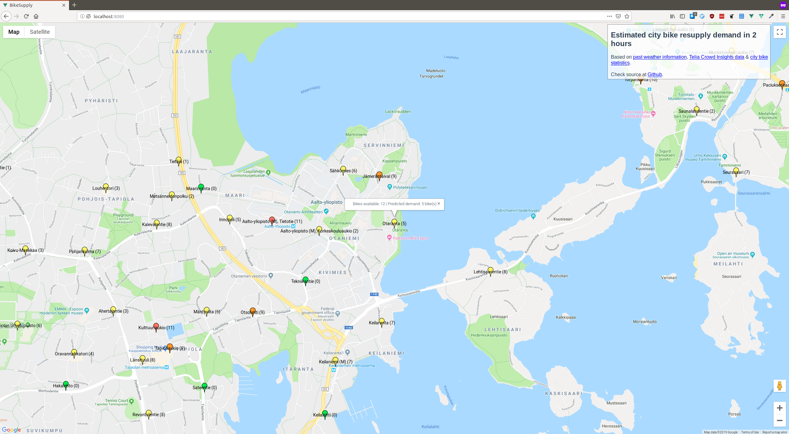

# Junction 2018 - Weatherall

Our entry for the Junction 2018 hackathon: an app for predicting city bike resupply demand. Consists of
- A prediction model based on city bike usage statistics, FMI weather data and Telia Crowd Insights data
- Integration to a Vaisala sensor device for real-time weather data
- A map-based UI

## Team

- Fraser Barclay
- Mohamed Karim Bouaziz
- Mikaela Hallenberg
- Aleksi Pekkala
- Katri Tegel

## Install

### Setup backend

1. Install `pipenv`
2. Run `pipenv install` to install deps
3. Start app with `pipenv run python app.py` (or open `pipenv shell` and run `python app.py`)

### Setup frontend

1. `cd frontend`
2. `npm install`
3. `npm run serve` -> App will run in http://localhost:8080/

### Setup datascience

#### Jupyter notebook

1. `cd datascience`
2. `pip install -r requirements.txt`
3. `jupyter notebook` -> App will run in http://localhost:8888/
